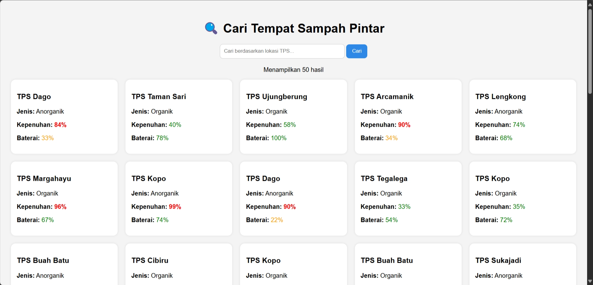

# Smart Waste Bin Monitoring (Monolith Laravel + Public API)

Proyek ini adalah implementasi tugas mata kuliah dengan topik **Integrasi Public API pada Aplikasi Monolith Sederhana**. Aplikasi ini menampilkan data simulasi dari tempat sampah pintar (smart waste bin) menggunakan **Laravel** sebagai backend dan **MockAPI.io** sebagai sumber data.

## 📌 Fitur Utama

- Menampilkan daftar tempat sampah pintar (Smart Waste Bin)
- Mengambil data dari MockAPI sebagai public API
- Search bar untuk mencari TPS berdasarkan nama lokasi
- Indikator visual untuk kepenuhan dan kondisi baterai

## 📡 Public API yang Digunakan

- **Provider**: MockAPI.io
- **Endpoint**: [`https://67e62f6d6530dbd3110efdce.mockapi.io/smart-waste-bin`](https://67e62f6d6530dbd3110efdce.mockapi.io/smart-waste-bin)

### Struktur Data API:
```json
{
  "id": "1",
  "location": "TPS Cijawura",
  "type": "Organik",
  "fullness": 85,
  "battery": 65
}
```

## 🛠️ Teknologi yang Digunakan

- Laravel 
- Laravel HTTP Client
- Blade Template Engine
- MockAPI.io (untuk simulasi data IoT)
- HTML & CSS Native

## 🔍 Cara Menjalankan Aplikasi

1. Clone repo:
```bash
https://github.com/memorism/monolithSmartWasteBin.git
cd monolithSmartWasteBin
```

2. Install dependency:
```bash
composer install
```

3. Jalankan Laravel:
```bash
php artisan serve
```

4. Akses aplikasi:
```
http://127.0.0.1:8000/bins
```

## 📸 Screenshot

### Halaman Pencarian dan Hasil:


## 🙋‍♀️ Author

- Nama: Reza
- NIM: 1202213199
